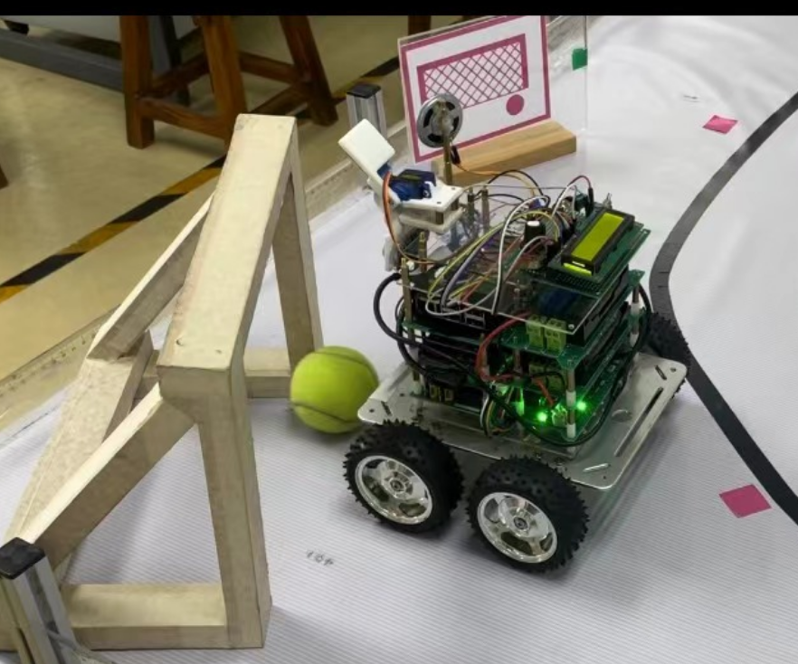
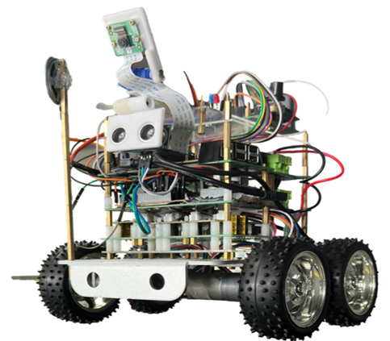

# Undergraduate_smart_car_project 
**Line Tracing Smart Car**

_**This projecct is from my undergraduate Lab course, which developed an intelligent line-following robot on Raspberry Pi (C++), integrating OpenCV vision-based tracking, PID closed-loop control, and UART motor control to achieve autonomous navigation and task execution.**_

Below are the mian functions of the whole projects:

_1) Vision-based line tracing:Captured real-time video via OpenCV_  
_2) PID closed-loop steering control：Fed the lateral error into a PID controller (Kp/Ki/Kd)_  
_3) Chassis motion control via UART: Applied speed limiting and fallback handling when the line was temporarily lost_  
_4) Task marker detection & automatic stopping: Detected magenta task markers using HSV segmentation and contour/geometry checks_  
_5) Task recognition (template / colour-based):Classified tasks using template matching and ROI colour detection (red/yellow/green/blue)_  
_6) Peripheral integration for multi-task execution:Ultrasonic distance-based stopping (TRIG/ECHO) and Servo camera tilt control using_  

One task example: football kiking:

  

The Template Matching process:

  

## Environment & Dependencies

- Hardware: Raspberry Pi4b + Raspberry Camera + Ultrasonic Sensor +  SG90 Servo motor Servo + LCD1602
- OS: Raspberry Pi OS
- Language: C++
- Libraries:
  - wiringPi (GPIO / PWM / timing)
  - OpenCV (computer vision)
  - lcd (HD44780 LCD driver)
  - wiringSerial (UART motor control)

